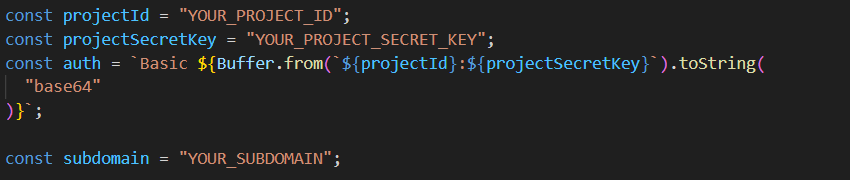
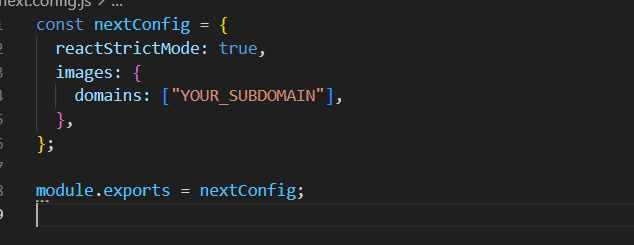

To run this project

First run the command 'npm install' to insatll all the dependencies 
Also get your account at infura.io and replace your Project_Id,Secret_Key and Subdomain in the file,
located at context/Voter.js
 
and also in next.config.js file
